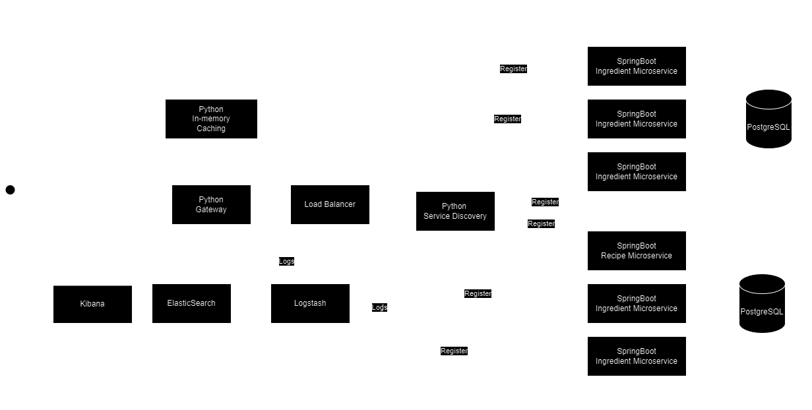

# PAD_LABS
This laboratory work comprises a microservice based system for storing ingredients and generating recipes. 

## System Architecture



#### Load balancer: 
Entry point to the system, distributes incoming traffic across microservices. Ensures High Availability and Load 
Distribution.

#### API Gateway
Manages and routes requests to the appropriate microservices. Provides single entry point for client, enforces 
request handling.

#### Caching
Store frequently accessed data, reduce the need to fetch data from the database.

#### Logging
Records events and activites, helps track and diagnose issues, analyze system behaviour.

#### Ingredient Microservice
Responsible for managing ingredient related data. It connects to database to store and retrieve information about 
ingredients.

#### Recipe Microservice
Manages recipe-related data and interacts with its own database. Handles recipe creation, retrieval, updates.

#### Service Discovery
Provides dynamic service registration and discovery. Allows microservices to find and communicate with each other.

## Ingredient Microservice Endpoints
#### NOTE: In order for the microservice to run correctly, access the POST endpoints first. Specifically, addIngredient or addIngredients.

### `GET /status`

- **Description:** Get the service status.
- **Request Method:** GET
- **Request Body:** None
- **Response:**
    - *Content-Type:* `text/plain`
    - *Body:* A string indicating the service status, e.g., "Service status: UP"

### `POST /addIngredient`

- **Description:** Add a single ingredient.
- **Request Method:** POST
- **Request Body:**
    - *Content-Type:* `application/json`
    - *Body Example:*
      ```json
      {
          "id": 1,  // Auto-generated by the server
          "ingredient": "Example Ingredient"
      }
      ```
- **Response:**
    - *Content-Type:* `application/json`
    - *Body:* The added ingredient as a JSON object.

### `POST /addIngredients`

- **Description:** Add multiple ingredients.
- **Request Method:** POST
- **Request Body:**
    - *Content-Type:* `application/json`
    - *Body Example:*
      ```json
      [
          {
              "id": 1,  // Auto-generated by the server
              "ingredient": "Ingredient 1"
          },
          {
              "id": 2,  // Auto-generated by the server
              "ingredient": "Ingredient 2"
          }
      ]
      ```
- **Response:**
    - *Content-Type:* `application/json`
    - *Body:* An array of the added ingredients as JSON objects.

### `GET /ingredients`

- **Description:** Get all ingredients.
- **Request Method:** GET
- **Request Body:** None
- **Response:**
    - *Content-Type:* `application/json`
    - *Body:* An array of ingredients as JSON objects.

### `GET /ingredient/{id}`

- **Description:** Get an ingredient by ID.
- **Request Method:** GET
- **Request Body:** None
- **Response:**
    - *Content-Type:* `application/json`
    - *Body:* The ingredient with the specified ID as a JSON object.

### `PUT /update`

- **Description:** Update an existing ingredient.
- **Request Method:** PUT
- **Request Body:**
    - *Content-Type:* `application/json`
    - *Body Example:*
      ```json
      {
          "id": 1,  // The ID of the ingredient to update
          "ingredient": "Updated Ingredient"
      }
      ```
- **Response:**
    - *Content-Type:* `application/json`
    - *Body:* The updated ingredient as a JSON object.

### `DELETE /delete/{id}`

- **Description:** Delete an ingredient by ID.
- **Request Method:** DELETE
- **Request Body:** None
- **Response:**
    - *Content-Type:* `text/plain`
    - *Body:* A string indicating the result of the deletion, e.g., "Ingredient deleted successfully" or an error message.

# Recipe Microservice Endpoints

#### NOTE: In order for the microservice to run correctly, access the POST endpoints first. Specifically, addRecipe.

### `GET /status`

- **Description:** Get the service status.
- **Request Method:** GET
- **Request Body:** None
- **Response:**
  - *Content-Type:* `text/plain`
  - *Body:* A string indicating the service status, e.g., "Service status: UP"

### `POST /notify`

- **Description:** Receive and log a notification message.
- **Request Method:** POST
- **Request Body:**
  - *Content-Type:* `application/json`
  - *Body Example:*
    ```json
    "Your notification message here"
    ```
- **Response:**
  - *Content-Type:* `text/plain`
  - *Body:* A string indicating the received message.

### `POST /addRecipe`

- **Description:** Add a new recipe.
- **Request Method:** POST
- **Request Body:**
  - *Content-Type:* `application/json`
  - *Body Example:*
    ```json
    {
        "id": 1,  // Auto-generated by the server
        "recipeId": "Recipe123",
        "name": "Example Recipe",
        "ingredients": ["Ingredient1", "Ingredient2"],
        "instructions": "Step 1, Step 2, ..."
    }
    ```
- **Response:**
  - *Content-Type:* `application/json`
  - *Body:* The added recipe as a JSON object.

### `GET /recipe/{recipeId}`

- **Description:** Get a recipe by ID.
- **Request Method:** GET
- **Request Body:** None
- **Response:**
  - *Content-Type:* `application/json`
  - *Body:* The recipe with the specified ID as a JSON object.

### `GET /recipes`

- **Description:** Get all recipes.
- **Request Method:** GET
- **Request Body:** None
- **Response:**
  - *Content-Type:* `application/json`
  - *Body:* An array of recipes as JSON objects.

### `GET /recipes/{ingredient}`

- **Description:** Get recipes by ingredient.
- **Request Method:** GET
- **Request Body:** None
- **Response:**
  - *Content-Type:* `application/json`
  - *Body:* An array of recipes containing the specified ingredient as JSON objects.

